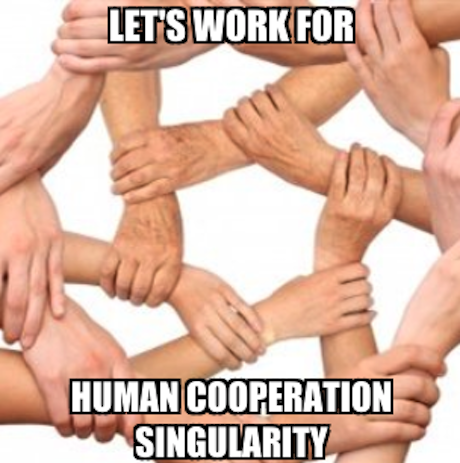

### Building the IPFS Community



---

### ProtoSchool

_We are a group of people <br>passionate about the decentralized web <br>and excited to learn, teach, and share ideas. 
<br>Everyone is welcome!_

supported by Protocol Labs

+++

Feature: Online Tutorials for Go developer using ```present``` ([issue](https://github.com/ProtoSchool/protoschool.github.io/issues/172))

---

<h3 align="center"> Creative Learning </h3>


---

### The Cooperation Triangle

- Motivation
- Competence
- Community

---

### Motivation

From Curious to Professional

- come as you are
- work on your ideas
- make your living with passion

---

### Competence

From 101 to Product Development

- "The journey of a thousand miles begins with one step." - Lao Tzu
- T-shaped skills
- support by Protocol Labs
- community of persons, companies, and communities

---

### Community

- community starts with yourself
- be open and stay focused
- persons, companies, and communities

---

### Discussion

- Impressions
- Questions

---

### What's next?

- ideas and issues
- continue in groups
- get together for the results
